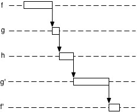

# Continuation Passing Style

## Аналогия

**CPS** подобен игре с мячом, вывающие функции являются игроками, а callback - действием с мячом :

```javascript
  function f() {
    g(ball => console.log(ball));
  }

  function g(actionWithBall) {
    h(actionWithBall);
  }

  function h(actionWithBall) {
    actionWithBall('ball');
  }
```

- `actionWithBall` в данном случае является действием с мячом;
- мяч представляет собой управление потоком (control flow)
- игрок `f` - знает, что нужно сделать с мячом (например, пробить по
  воротам) и объясняет это игроку `g`, пасуя ему мяч (передаёт действие);
- игрок `g`, в свою очередь, пасует мяч `h`;
- `h` выполняет действие `actionWithBall`, например пинает мяч по воротам,
  сообщая `g'`, что действие выполненно,
- `g'` передаёт сообщение дальше `f'`. (поднимаясь вверх по стеку, но по
  факту они уже ничего не делают)
  



В то время как, при **Direct Style** игроки ведут себя следующим образом:

```javascript
  function f() {
    console.log(g());
  }
  
  function g() {
    return h();
  }
  
  function h() {
    return 'ball';
  }
```

- Игрок `f` хочет пробить по воротам, лично. Он обращается к игроку `g` :
  "Эй мне нужен мяч, но я не скажу тебе зачем, это не твоё дело."
- `g` вообще не знает, ничего про мяч, единственное, что он может
  это обратиться к `h`, что и делает.
- `h` знает про мяч, он у него. И отвечает: да на, жалко что-ли и передаёт мяч `g`,
- `g` передаёт его `f`, который всё это время ждал.
- и, наконец, когда мяч оказывается у `f` он пробивает по воротам.

